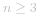
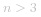
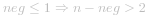
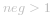
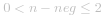
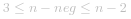

## 1. 暴力破解
首先不能使用前缀和，因为三个数字不是连续的。暴力解法就是枚举三个数字：
```python
class Solution:
    def maximumProduct(self, nums: List[int]) -> int:
        n = len(nums)
        return max(nums[i] * nums[j] * nums[z] 
            for i in range(n) for j in range(i + 1, n) for z in range(j + 1, n))
```
这样时间复杂度为 *O(n^3)*，原因是数字之间无序排列，只能通过枚举所有可能来确定最大乘积。
## 2.贪心证明
贪心思路来源：先不考虑负数，三数乘积结果最大值肯定是三个最大正数，因此启示我们找到数组中最大三个正数即可。则要进行排序操作。

现在证明贪心思路，设长度为   数组 *nums* 排序后有 *neg* 个负数，则有 *n -neg* 个非负数（即正数+零总个数），且对数组排序后**负数肯定在数组左侧**，**非负数肯定在数组右侧**。


若 *n = 3*：没得挑，结果只能是 ![maxPro=nums\[0\]\timesnums\[1\]\timesnums\[1\] ](./p__maxPro_=_nums_0__times_nums_1__times_nums_1__.png) 

下面讨论   情况：
1. 若  ：选择最大三个正数相乘的积最大，即 ![maxPro=nums\[-1\]\timesnums\[-2\]\timesnums\[-3\] ](./p__maxPro_=_nums_-1__times_nums_-2__times_nums_-3__.png) 。

**图解：**
```c
1. neg = 0，有至少三个正数：此时选择最大三个数相乘的积最大
无负数          正数(选最大三个)
                + + + + + 
                    ^ ^ ^
2. neg = 1，有至少三个正数：此时选择最大三个数相乘的积最大
负数            正数(选最大三个)
 -              + + + + + 
                    ^ ^ ^
```

2. 若  ：数组(   )中至少有**两个负数**，正数个数不确定。
    + 当数组中**全负数**时，选择组合为“**负负负**”，此时乘积必定为负。
        + “**负负得正**”，因此乘积变为 **正数 * 负数**。想要乘积最大，那么**正数越小**，**负数越大**
        + 想要由两个负数组成正数月下，那么这两个负数应该越大，即 `nums[-1] * nums[-2]`；由于当前已用掉两个最大负数，因此最后一个负数取最大就是 `nums[-3]` 
        + 因此选择最大的三个负数乘积最大，即 ![maxPro=nums\[-1\]\timesnums\[-2\]\timesnums\[-3\] ](./p__maxPro_=_nums_-1__times_nums_-2__times_nums_-3__.png) 
    + 若  ：即数组有 *(0, 2]* 个**非负数** 和 *[2, n-2]* 个**负数**。
        + 此时必定选择“**正负负**”组合。因为“**负负负**”和“**正正负**”结果都是负数。
        + 因“**负负得正**”，所以选择两个最小负数乘积 ![nums\[0\]\timesnums\[1\] ](./p__nums_0__times_nums_1__.png)  可得最大正数，再乘一个最大正数 *nums[-1]* 结果将更大，即有 ![maxPro=nums\[0\]\timesnums\[1\]\timesnums\[-1\] ](./p__maxPro_=_nums_0__times_nums_1__times_nums_-1__.png) 
    + 若  ：即数组有 *[3, n-2]* 个**非负数** 和 *[2, n-3]* 个**负数**。
        + 此时选择组合只能有“**正负负**”和“**正正正**”，因为其它组合都是负数。
        + “**正负负**”组合：见上面分析，即 ![maxPro=nums\[-1\]\timesnums\[-2\]\timesnums\[-3\] ](./p__maxPro_=_nums_-1__times_nums_-2__times_nums_-3__.png) 
        + “**正正正**”组合：![maxPro=nums\[-1\]\timesnums\[-2\]\timesnums\[-3\] ](./p__maxPro_=_nums_-1__times_nums_-2__times_nums_-3__.png) 
    + 综上因为  ，数组下标不超界，将条件合并得 ![maxPro=\max(nums\[-1\]\timesnums\[-2\]\timesnums\[-3\],nums\[0\]\timesnums\[1\]\timesnums\[-1\]) ](./p__maxPro_=_max_nums_-1__times_nums_-2__times_nums_-3_,_nums_0__times_nums_1__times_nums_-1___.png) 

**图解**：
```c
1. neg = n，全负数：此时选择最大三个负数相乘的积最大，因为距离 0 最小
负数（选最大三个）                无正数
- - - -         0       
  | | |________|
  | |    d1     
  | |__________|
  |      d2
  |____________|
         d3

2. 0 < pos ≤ 2：此时选择 “正负负” 组合最大
负数（选最小两个）       正数（选最大）
- - - -     0          + +
| |________| |___________|
|    d1            d3
|__________|
     d2
3. 3 ≤ pos ≤ n-2：至少三个正数+至少两个负数
情况一：“正正正”组合
负数                  正数（选最大三个）
- -        0       + + + + + 
             |_________| | |
                  d1     | |
             |___________| |
                  d2       |
             |_____________|
                  d3
情况二：“正负负”组合
负数（选最小两个）       正数（选最大）
- - - -     0          + +
| |________| |___________|
|    d1            d3
|__________|
     d2
```


上述两个条件判断其实可以合并起来：
1. 若 *neg = 0*：数组中全为非负数，![\begin{cases}nums\[0\]\lenums\[-3\]&n\ge3\\nums\[1\]\lenums\[-2\]&n\ge3\\nums\[-1\]=nums\[-1\]&n\ge3\\\end{cases} ](./p__begin{cases}_nums_0__le_nums_-3___&_n_ge_3___nums_1__le_nums_-2___&_n_ge_3___nums_-1__=_nums_-1___&_n_ge_3___end{cases}_.png) ，不等式相等的原因是前后三个对应位置上的数可能相等，则有
![\\maxPro=\max(nums\[-1\]\timesnums\[-2\]\timesnums\[-3\],nums\[0\]\timesnums\[1\]\timesnums\[-1\])\\=nums\[-1\]\timesnums\[-2\]\timesnums\[-3\] ](./p___maxPro_=_max_nums_-1__times_nums_-2__times_nums_-3_,_nums_0__times_nums_1__times_nums_-1____=_nums_-1__times_nums_-2__times_nums_-3__.png) 
2. 若 *neg = 1*：数组中只有一个负数 ![nums\[0\]\lt0 ](./p__nums_0__lt_0_.png) ，![\begin{cases}nums\[0\]\ltnums\[-3\]&n\ge3\\nums\[1\]\lenums\[-2\]&n\ge3\\nums\[-1\]=nums\[-1\]&n\ge3\\\end{cases} ](./p__begin{cases}_nums_0__lt_nums_-3___&_n_ge_3___nums_1__le_nums_-2___&_n_ge_3___nums_-1__=_nums_-1___&_n_ge_3___end{cases}_.png) ，不等式相等的原因是前后三个对应位置上的数可能相等，则有
![\\maxPro=\max(nums\[-1\]\timesnums\[-2\]\timesnums\[-3\],nums\[0\]\timesnums\[1\]\timesnums\[-1\])\\=nums\[-1\]\timesnums\[-2\]\timesnums\[-3\] ](./p___maxPro_=_max_nums_-1__times_nums_-2__times_nums_-3_,_nums_0__times_nums_1__times_nums_-1____=_nums_-1__times_nums_-2__times_nums_-3__.png) 

综上所述，最终将所有条件合并为 
![maxPro=\max(nums\[-1\]\timesnums\[-2\]\timesnums\[-3\],nums\[0\]\timesnums\[1\]\timesnums\[-1\]) ](./p___maxPro_=_max_nums_-1__times_nums_-2__times_nums_-3_,_nums_0__times_nums_1__times_nums_-1____.png) 
### 代码
```python
class Solution:
    def maximumProduct(self, nums: List[int]) -> int:
        nums.sort()
        return max(nums[-1] * nums[-2] * nums[-3], nums[-1] * nums[0] * nums[1])
```
**复杂度分析：**
- **时间复杂度**： ，内置排序算法消耗
- **空间复杂度**： ，内置排序算法消耗


## 3. 「三数排序」
由上面分析可得，我们最终答案判断只要求**最小的两个负数**，**最大的三个数**，因此我们完全可以不用对全部数字排序。使用变量维护即可。也就是「三数排序」问题。

### 代码
```python3 []
class Solution:
    def maximumProduct(self, nums: List[int]) -> int:
        min1, min2 = [float('inf')] * 2  # 两个负数最小值
        max1, max2, max3 = [float('-inf')] * 3  # 三个最大正数值
        for num in nums:
            min1, min2, _ = sorted([min2, min1, num])
            _, max1, max2, max3 = sorted([max1, max2, max3, num])
        return max(min1 * min2 * max3, max1 * max2 * max3)
```
```c []
void swap(int *a, int *b) {
    int tmp = *a;
    *a = *b;
    *b = tmp;
}

void sort3num(int *a, int *b, int *c) {
    if (*b > *c) swap(b, c);  // b < c
    if (*a > *b) swap(a, b);  // a < b
    if (*b > *c) swap(b, c);  // a < b < c
}

int maximumProduct(int* nums, int numsSize){
    int min1 = INT_MAX, min2 = INT_MAX;
    int max1 = INT_MIN, max2 = INT_MIN, max3 = INT_MIN;
    for (int i = 0; i < numsSize; ++i) {
        int tmp = nums[i];
        // 1. 更新最小值，实现三数排序 min1 < min2 < tmp
        sort3num(&min1, &min2, &tmp);

        tmp = nums[i];
        // 2. 更新三个最大值，实现四数排序 tmp < max1 < max2 < max3
        sort3num(&tmp, &max2, &max3);  // tmp < max2 < max3
        if (max1 < tmp) swap(&max1, &tmp);  // tmp < max1 < max2 < max3
    }
    return fmax(min1 * min2 * max3, max1 * max2 * max3);
}
```
**复杂度分析**：
- **时间复杂度**：*O(n)*，扫描一遍即可。
- **空间复杂度**：*O(1)*，python 为方便条件判断进行排序操作消耗 *O(n)* 空间，C 代码中手动实现 「三数排序」。